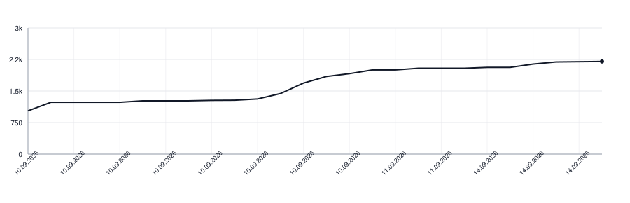

# readalign-swift

[](https://github.com/apakabarlabs/readalign-swift/actions/workflows/tests.yml)
[](https://apakabarlabs.github.io/readalign-swift/documentation/readalign/)

Lines a speech recogniser's output up against the text that was read, and says when each word of that text was spoken.

This is not transcription. The words are known in advance; the recogniser is only asked where they are, and it will get some of them wrong, the more so the further the text is from what it was trained on. So words are matched by how alike they look on paper rather than by equality, and a word left unmatched has its time interpolated from the words around it.

## What it handles

- **A misheard word.** `stowage` comes back as `stoage`, `harbour` as `harbor`. Matched on similarity, so the word keeps its own time.
- **A word the recogniser wrote without its diacritics.** `čaša` comes back as `casa`, `łódź` as `lodz`. Likeness is measured with the marks lifted, or a short word in a language that uses them would not be found at all.
- **A word boundary in the wrong place.** `shouldst owe` comes back as `should stow`: the same sound, the gap moved one consonant cluster. Matched as a pair, on a stricter bar than a single word.
- **One written word heard as several.** A hyphenated compound says how many parts it has, and the whole of what was heard is timed across all of them.
- **Several written words heard as one.** `every where` comes back as `everywhere`; the stretch is shared out between them by speech weight rather than given to both.
- **A word nobody said.** A gap costs less than a bad pair, so a false start or an `um` is passed over instead of being pushed into a neighbouring word.
- **A run of words the recogniser dropped.** Their time is shared across the gap they left, by speech weight, so a long word does not get the same slice of a pause as `a`. If the gap is nothing at all, room comes from the neighbour that swallowed them.

## Use

```swift
import ReadAlign

let spans = TranscriptAligner.align(
    expected: ["From", "fairest", "creatures", "we", "desire", "increase"],
    heard: [
        RecognizedWord(text: "from", start: 0.00, end: 0.32),
        RecognizedWord(text: "farest", start: 0.32, end: 0.81),
        RecognizedWord(text: "creatures", start: 0.81, end: 1.44),
        RecognizedWord(text: "we", start: 1.44, end: 1.60),
        RecognizedWord(text: "desire", start: 1.60, end: 2.08),
        RecognizedWord(text: "increase", start: 2.08, end: 2.72)
    ],
    duration: 3.0
)
// spans[1] == WordSpan(start: 0.32, end: 0.81)
```

One span per expected word, in reading order. What a word is on the page — which line it sits in, which of its letters get painted — stays with the caller.

The one exception is a recording nothing was heard in: that comes back empty rather than with a span per word, because every span would be a guess dressed as a measurement. Check for it before indexing.

Words go in **as they are printed**, hyphens and elision marks and all. `pair` normalises them itself, and it counts the parts of a hyphenated compound before it does; handing it words already stripped of their hyphens tells it every word prints as one, and a compound heard as three words can then never be matched at all.

To ask only which word came back as which, without times:

```swift
let matches = TranscriptAligner.pair(
    expected: ["hearts", "shouldst", "owe"],
    heard: ["hearts", "should", "stow"],
    threshold: 0.6
)
// the pair whose boundary moved comes back as one match: expected 1..<3, heard 1..<3
```

### Recogniser patches

`pair` and `align` both take an optional `equivalent` closure, asked as `(written, heard, the written word before it)`. It is for pairs a particular recogniser reliably gets wrong in a way similarity cannot carry: `heir` and `air` share two letters and would never be offered for comparison otherwise, so the patch that knows better is never asked unless the patch reaches the alignment itself. Homophones are why `align` takes it too: read aloud, `queue` comes back written `cue`, and a reading refused over that is a good recording thrown away.

The predecessor comes along because such a patch is often confined to one turn of phrase, and only the alignment knows what stands where.

It is asked with either side joined up as well, because a recogniser writes a hyphenated compound as two words and two written words as one, and both are one entry in a patch table. Without the joined-written question a model that runs two words together is unpatchable: `in sense` comes back `incense`, which is what those two words sound like said in a row, and similarity alone will not carry it over the join bar. Narrowing the patch entry to the second word instead does not work, since the one heard word is then spent on it and the first has nothing left to match.

### Holding a word open through the silence after it

One of the two calls that need the recording. A recogniser marks where a word stops being audible, not where the voice has finished with it, so a passage played to the mark stops a hair short of itself. Give `SilenceHold.held` the samples and the marks come back carried into the quiet, and never into the word that follows.

### Reading what a recogniser answered

A recogniser answers in tokens, not in words: `▁be`, `aut`, `y's`. `Words.spoken` gathers them into words, timed from the token each opens with to the one it closes with. A token opening with `▁`, a space or `|` opens a word; marks at either end of a word are the model's punctuation and are left off, while marks inside it stay, because `beauty's` and `self-substantial` are words and `beautys` is not.

Here rather than in each caller, because where one word ends is the model's convention. Written out by each side, one returns `beauty's` where another returns `beautys` and a third splits the word in two, and the three readings cannot be held against each other however alike they heard the sound.

### Cutting a recording into pieces

The other. A recogniser given a long reading cuts it into windows of its own, and every runtime cuts differently: a forty-second reading handed whole to one and in fifteen-second windows to another is two different questions, and the answers cannot be held against each other. `Pieces.cuts` returns the ranges to ask in, cut at the pauses `Pieces.pauses` finds and overlapping so that no word falls on a seam. Where no pause offers itself the piece ends on length alone, and then there is no overlap to give. Two pieces meeting that way share no ground and the join has nothing to settle them by, which costs a word at that seam on a runtime that pads its input to a fixed length: a recogniser invents a word while it is hearing the last of what it was given. A floor on the overlap was measured against that and is deliberately absent. Moving the start of a piece changes the length of what the model is asked, and this model answers a different length with different words, so a floor that lowers every seam under it — 223 of 631 over 154 readings, to mend the 57 that share nothing — costs more than it saves. A floor that applies only where the overlap is nothing has not been measured.

A pause is found against the threshold the recording sets for itself: quiet is what stands well below its quietest tenth. A reading with hardly any silence in it therefore offers no pause at all and is cut on length, because there nothing stands out from that tenth.

`Pieces.joined` takes what each piece came back with, in the seconds of that piece, and gives back the reading in the seconds of the whole recording. The overlap means a word at a seam arrives twice, and the second copy goes by the text: the longest run the two pieces say alike inside the overlap is found, and everything the coming piece says up to the end of it comes off. A piece the recogniser had nothing to say about adds nothing, which is an answer rather than a fault. A transcript missing for a piece is refused: every word after it would otherwise be placed at the wrong moment, and the reading would come back looking whole.

By the text and not by the clock, because the clock is the one thing two builds of one model do not share. Measured on a sonnet, the same word came back 0.20 s apart in two pieces of one recording, and a different runtime marks it somewhere else again: a rule that asks how close two marks are then keeps the word twice on one build and once on another, from the same recording and the same cut. Searching only inside the overlap is what keeps a word the reading genuinely says twice from being taken for a second copy.

The run is looked for anywhere inside the overlap rather than at its edges, because a recogniser drops or invents a word at the edge of what it was given: one piece ended `...by time decease we` where the other heard no `we` at all, and a run pinned to the edges would have found nothing and left the whole overlap said twice. A run of a single word counts only when it is the whole of what the coming piece says in the overlap, or a word as common as `the` would pair with itself by chance.

Past the run the coming piece is believed and the piece before it is not. They cover the same seconds there, and the one that goes on past them heard them with what follows, while the other was hearing the last of what it was given — which is where a recogniser invents. So `we` above does not reach the reading at all.

### When the recogniser answers nothing at all

Parakeet answers some pieces of ordinary speech with no words at all. Whether it does turns on where the piece starts and how long it is together rather than on the speech in it: the mel statistics are taken over the piece, so its length moves them, and past some edge the decoder predicts blank at every frame. Handing over a little less of the tail moves the piece off that edge.

`Pieces.heard` calls the recogniser for you and asks again while nothing comes back, taking `ask_again_trims` off the tail in turn and keeping the first answer with words in it. Measured over ten sonnets it gave back every silent piece. A piece shorter than `shortest_worth_asking_again` is asked once: nothing here tells speech from silence, so a piece that is genuinely quiet would otherwise pay for the whole list before answering nothing. What comes back is missing whatever was said in the trimmed tail, which the overlap with the next piece covers.

### Other languages

Time is shared out among unmatched words by `SpeechWeighting`. A protocol rather than a function so each language brings its own: syllable counting by vowel groups holds for English and breaks on languages that write vowels differently or not at all.

`EnglishSyllableWeighting` counts vowel groups less a silent final `e`, not dropped after `l`. It is wrong on plenty of words (`fire`, `buried`), which is affordable while it only decides whether `self-substantial` gets four times the airtime of `I`. `EvenWeighting` counts every word as one, for a language whose syllables this package cannot count. Pass your own for anything else — but note that what comes back from it is not trusted: a weight that is not a finite number is read as one, because a comparison against such a value is false whichever way round it is put and it would otherwise travel through into every span.

## How it works

### The alignment

Needleman-Wunsch over the two sequences. Both are in reading order, so the alignment may skip words on either side but never reorder them.

Aligning the whole utterance at once, rather than walking forward and stopping at the first divergence, is what lets a caller be told which words went wrong rather than only where things first went wrong: a word mangled in the middle of a line no longer hides the correct words after it.

Every cell of the table is the best of six moves: the two words straight against each other, a skip on either side, one written word against a run of heard words joined up, two written words against one heard word joined up, and both sides joined at once.

### What each move is worth

| move | worth |
|---|---|
| a straight pair at or above the bar | its similarity, `0.6`–`1.0` |
| a joined pair at or above the join bar | its similarity, `0.9`–`1.0` |
| anything below its bar | `-1.5` |
| skipping one word, either side | `-0.5` |

Two words that are merely not opposites still share letters, so raw similarity would pair anything with anything rather than leave a word unpaired. Below the bar a pairing has to be worth **less than passing both words over**, which is what puts a false start outside the line instead of on top of its first words. That is the whole job of the `-1.5`: it is not a measurement, only a number low enough that two skips at `-0.5` beat it.

Note that the bar is applied twice, and the second time is what decides the answer. The table uses these numbers to pick a path; the walk back then records a match only where the pair actually clears its bar. A path may run diagonally through a pair too unalike to be a match, and nothing is recorded there — which is why the exact size of the mismatch price is invisible in the result, and only its being worse than two skips matters.

### Why the join bar is stricter

Word boundaries are not agreed on: a recogniser hears `self-substantial` as two words and `whatever` as one, and neither is a mistake by the reader. So a word may also be matched against the words next to it on the other side, joined up — but only on a near-exact match.

Loosely, joining swallows the neighbouring word whole: `creatures we` would pass as `creatures`, and a swallowed word is one the reader never has to say. Hence `max(threshold, 0.9)` rather than the ordinary bar.

How many heard words one written word may be spread over comes from print: `swift-footed` is two parts, `world-without-end` three. Anything else may still take a pair, since a recogniser splits a long word wherever it likes.

### Tokens with no letters in them

A numeral, a stray mark, or a token a recogniser emitted for a noise normalises to nothing. Joining onto one is free — it adds nothing to the joined string, so it cannot lower the likeness — and a free join hands that token's whole stretch of the recording to the word beside it. `From 1999 fairest` would give `From` everything up to `fairest`.

Nothing is being joined there in any case: a join moves a boundary between two words, and that side has no word. Such a token is passed over instead, which is what the skip is for.

### Placing the words that were not matched

Matched words keep the times they were heard at. An unmatched run is shared across the gap between its nearest matched neighbours, by speech weight, so a long word does not get the same slice of a pause as `a`.

A run can be left no gap at all. The recogniser writes `your self` as one word, the alignment matches that word to `self`, and `your` is left between two marks that touch. Spread across nothing it comes out with no length, and no instant of the recording falls inside a word of no length: a mark that runs along the line as the recording plays passes straight over it, every time.

Room then comes from the neighbour that was holding it — the one dwelling longest on each of its own syllables. A word the recogniser ran another word into keeps both their sounds and so reads as unnaturally slow; its neighbour on the other side is saying only itself.

The same sharing happens inside a single match when several written words were heard as one: `every where` written down as `everywhere`. Given the whole of it, they would lie on top of one another and the first would have nothing left once the ends are tidied.

### Comparing two words

`normalize` keeps letters only, lowercased. Elision marks and punctuation are exactly what a recogniser drops or invents, so comparing without them compares what was actually said.

`similarity` is edit distance over the longer length: `1` for identical, `0` for nothing in common.

## What is shared with the other ports

Two things live as data rather than as code, so that a port in another language reads them instead of holding its own copy.

`Sources/ReadAlign/Resources/rules.yaml` holds every number the alignment is tuned to: the two bars, the price of a gap and of a bad pair, the shortest span a word can be found at, the letters the English weighting counts as vowels, the letters that carry their mark through the letter itself, the marks that join one consonant to the next, the five that decide how a word is held through the silence after it, and the four that decide where a recording is cut into pieces. Changing one of them changes every port, rather than leaving them quietly apart.

Where a word is cut into letters is in there too, and it has to be. Every platform answers that question, and they answer it differently and at different vintages: one cuts a zero-width joiner away from the word it joins, another breaks a joined pair of consonants in two, and a third answers whatever the phone's operating system happens to know. A library whose whole claim is that three ports read one word cannot leave that to the platform, so the cutting is done here, by rules written down, and pinned letter by letter in the cases.

One thing is still the platform's: which general category a character belongs to. The three runtimes carry that table at different Unicode vintages, so a character added to Unicode more recently than the oldest of them may be read as a letter by two ports and not by the third. Across the whole Basic Multilingual Plane that is 137 characters of 50412, all of them recent additions; it is a known edge rather than a disagreement about how words are read.

There is a Python port at [readalign-python](https://github.com/apakabarlabs/readalign-python) and a Kotlin one at [readalign-kotlin](https://github.com/apakabarlabs/readalign-kotlin), both of which sync these files from here and hold their copies against this repository with a test of their own. All three carry the same major and minor version, so equal numbers mean equal behaviour.

The cases live in YAML under `Tests/ReadAlignTests/Resources/`, one file per function, and every port is held to the same ones. What stays in Swift is only the runner.

A case pins what it was written to pin and nothing else: `want` lists spans by word index, with `start` and `end` both optional. Filling the rest in from whatever the code currently returns would record the code's opinion of itself rather than a requirement. What is true of every result — a span for every written word, no span ending before it starts, none of them going backwards — is stated once in the runner instead of being copied into each case. A case that asserts nothing fails, so a mistyped key cannot pass for agreement.

Each case carries a `why`, which is where the reason for it lives.

The corpus is checked by mutation: changing any value in `rules.yaml` must turn it red, and so must removing either empty-token guard, changing which neighbour a swallowed run takes its room from, or ignoring the patch mechanism.

Two things it does not hold, and cannot, because neither reaches the result:

- **The exact price of a bad pair, and of a skip.** As described above, a pair below its bar is never recorded whatever path the table took, so only the ordering matters — two skips have to be worth more than one bad pair. Set them far enough apart to break that ordering and the corpus does go red; move either a little and nothing changes, because nothing can.
- **Widening how far a join may reach.** The join bar rejects the extra material anyway, so a larger `join_span` only permits joins that were already alike enough. Narrowing it is held.

## Install

```swift
.package(url: "https://github.com/apakabarlabs/readalign-swift", from: "0.13.1")
```

Before 1.0, a minor release may change the API. Pin an exact version when that matters to you.

## Develop

```bash
make test-build  # compile the package and tests
make test        # run the shared corpus and Swift-specific tests
make lint        # commentcensor and SwiftLint
make docs        # build the DocC reference with warnings as errors
make build       # run every check and build the package
```

Releases are published by the repository's [Release workflow](https://github.com/apakabarlabs/readalign-swift/actions/workflows/release.yml), after it repeats the complete build.

## Documentation

The [Swift-DocC API reference](https://apakabarlabs.github.io/readalign-swift/documentation/readalign/)
is generated from the public API on every push to `main`.

## Lines of Code

<picture>
  <source media="(prefers-color-scheme: dark)" srcset=".github/loc-history-dark.svg">
  <source media="(prefers-color-scheme: light)" srcset=".github/loc-history-light.svg">
  
</picture>
